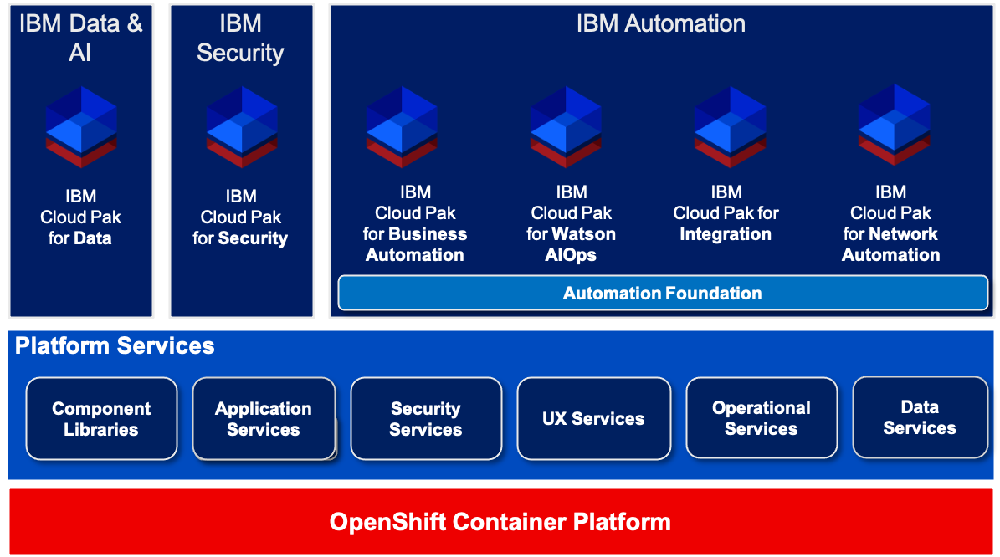

# IBM Cloud Pak Architecture Overview

The following picture is a high-level overview of the current Cloud Pak architecture by IBM.

As shown in the picture, *Red Hat OpenShift* is the foundation for all IBM Cloud Paks.  
On top of OpenShift, IBM Cloud Paks ship a layer of *common platform services* that provide capabilities like cluster logging and monitoring.  
The next layer is called *Automation Foundation* and provides additional capabilities across the product groups / Cloud Paks, such as Process Mining, Robotic Process Automation and asset sharing between Cloud Paks.  
As of today, the Automation Foundation layer is part of four IBM Cloud Paks, with the other ones possibly being added in the future.  
The final layer in the Cloud Pak architecture is the *solution layer* with the respective solutions of a given Cloud Pak (like IBM API Connect and IBM App Connect Enterprise in IBM Cloud Pak for Integration).  

As mentioned earlier, the *Telco Integrator* is implemented using various Cloud Pak solutions.  

The [Solution Overview](solution_overview.md) describes those components in more detail.

*References:*

[IBM Cloud Paks Landing Page](https://www.ibm.com/cloud/paks){target=_blank}