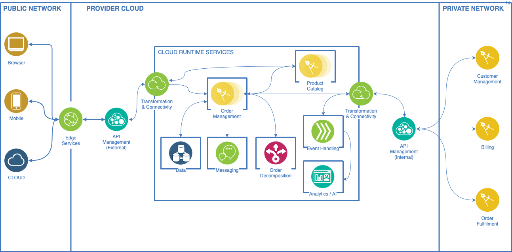

# Telco Integrator Solution Overview

As a realization of the Hybrid Reference Architecture, this asset implements an end-to-end Order Management process of a Telco Communications Service Provider. Applications such as the Product Catalog, Order Management System, Database and Messaging, run in isolated Kubernetes deployments and can reside in the Provider's data center or Private Cloud.

The following IBM products / Cloud Pak capabilities are used for the Telco Integrator's default implementation:

- The TM Forum APIs are exposed through IBM API Connect (APIC) and IBM DataPower.
- Routing and data transformation implemented in IBM App Connect Enterprise (ACE).
- IBM Event Streams manages order history, in-flight order events and notifications.
- IBM Sterling Order Management pipelines are used for order state management.
- Order decomposition and execution build plan decision system is provided by IBM Operation Decision Manager (ODM)

The external API Gateway serves TMF Open APIs to omni-channel consumers and provides the necessary security and governance. Data transformation and routing are handled by App Connect Enterprise.

Order Management process events are exposed through a Hub/Listener event model. Topics in Event Streams listens to events generated during the execution of the order process which are then forwarded to an analytics engine to provide insights and dashboards.

Other components like Order Management pipelines for Sterling Order Management, decomposition rules for ODM, TMF OPen API mapping templates, pre-built data transformation and routing logic all serve to accelerate customer implementations.